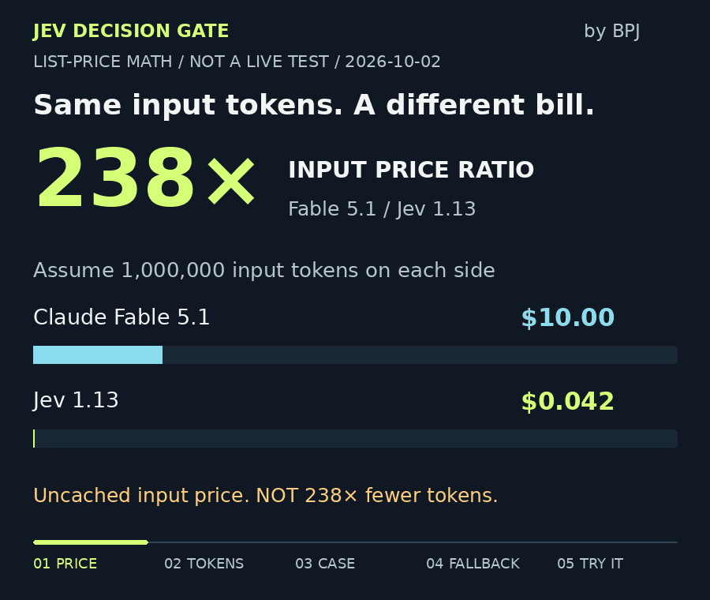

# Jev Decision Gate · by BPJ

[](https://github.com/f-tiger/jev-decision-gate/actions/workflows/test.yml)

**$10 → $0.042 per million input tokens. What could cheaper decisions change in your workflow?**

[中文](README.zh-CN.md) · [MCP setup](docs/mcp.md) · [Evaluation method](docs/evaluation.md) · [BPJ developer tools](https://baipiaoji.com/en/developers?utm_source=github&utm_medium=readme&utm_campaign=decision_gate)



**About 238× difference in input price, with the same hypothetical token volume.** Standard uncached prices on 2026-10-02: [Claude Fable 5.1](https://platform.claude.com/docs/en/about-claude/pricing) $10/M input tokens; [Jev 1.13](https://docs.typesafe.ai/models) $0.042/M. Against Haiku 4.5 ($1/M), the ratio is 23.8×. Actual token counts, quality and total savings need a live comparison. Free Jev output does not mean zero output tokens.

[Price math and assumptions](docs/token-cost.md) · [Static image](docs/assets/token-cost-en-poster.png) · [Actual rules output](docs/assets/demo-report.json)

An independent MIT-licensed Python tool for repository maintainers. Run a rules baseline, optionally call TypeSafe's Jev, and calibrate which suggestions may be accepted. The first case predicts **issue kind, affected module and information sufficiency**. It never edits issues, applies labels, posts comments or closes tickets.

Version **0.3.1**, early developer preview. This is an integration and statistical gate, **not Jev's model, training algorithm, or an official TypeSafe product**. Live Jev measurements are pending. The bundled cases are original synthetic examples, not customer outcomes or a representative benchmark.

## Run in two minutes

Python 3.11+:

```bash
git clone https://github.com/f-tiger/jev-decision-gate.git
cd jev-decision-gate
python -m venv .venv
# macOS / Linux
source .venv/bin/activate
# Windows PowerShell: .venv\Scripts\Activate.ps1
python -m pip install '.[mcp]'
jev-gate demo --out demo-report.json --export-issues demo-issues.json
```

The demo runs locally without keys or network requests. It produces real output from a deliberately simple rules baseline. All items initially require review. Keep the report: compare on your own labels before choosing a provider. Commands refuse to overwrite existing output files.

Reproduce the animation's price calculation without a key:

```bash
python tools/price_scenario.py --input-tokens 1000000 --fallback-fraction 0.1
```

This scenario is $0.042 for Jev input plus $1 for an extra 10% of that input sent to Fable, or $1.042 versus $10. The **9.6× input-cost ratio is hypothetical**, excludes output/retries/review, and does not imply this package calls Fable. [Share a successful run or a blocker](https://github.com/f-tiger/jev-decision-gate/issues/new?template=tryout.yml).

## Call Jev on selected issues

Set `TYPESAFE_API_KEY` through your local environment or secret manager. **Do not paste a key into an issue, model chat, repository or MCP configuration committed to Git.** Jev mode sends selected title/body text to `https://api.typesafe.ai/v1/systemone`; BPJ receives nothing.

```bash
jev-gate triage demo-issues.json --provider jev --max-calls 12 --out jev-report.json
```

The default pins `jev-1.13.0`. One request per issue batches three independent questions against the same issue. There are no automatic retries. Failure returns a review recommendation and records unknown usage rather than assuming zero cost. Exit code 2 means an input failure or a saved report with provider failures; inspect stderr and the report.

To estimate the cost of provider-reported input tokens, explicitly add `--input-usd-per-million YOUR_CURRENT_PRICE`. Output is an estimate, not an invoice. Failed calls may be billed without reported usage. Human review and fallback model costs are not measured, so the triage report leaves savings unset.

## Bring your own cases

```json
[
  {
    "id": "myrepo-123",
    "title": "Login fails after session expiry",
    "body": "Steps, environment, actual behavior and expected behavior...",
    "expected": {"kind": "bug", "module": "auth", "information": "sufficient"}
  }
]
```

`expected` is optional at inference time and required for calibration/evaluation. It is never sent to Jev. Use human-reviewed labels. Fixed labels in v0.3.0:

| Field | Labels |
|---|---|
| `kind` | `bug`, `feature`, `question`, `unknown` |
| `module` | `auth`, `api`, `ui`, `docs`, `unknown` |
| `information` | `sufficient`, `missing` |

This taxonomy is intentionally narrow. Repositories whose modules do not fit should customize the question contract and recalibrate. No claim is made about accuracy in Chinese or other languages; evaluate the language you actually use.

## Calibrate, then test separately

Run inference on independently labeled calibration and test files, then:

```bash
jev-gate calibrate calibration-report.json --out policy.json
jev-gate evaluate policy.json held-out-report.json --out evaluation.json
jev-gate triage new-issues.json --provider jev --policy policy.json --out decisions.json
```

The model, taxonomy and score mapping must be frozen before calibration. IDs must be disjoint across calibration and evaluation; semantic duplicates must also be removed by the dataset owner. Small samples or high error disable the gate. A disabled policy skips model calls and sends every item to review. Policy scope mismatches fail before inference.

The fixed threshold search uses an exact one-sided binomial bound with Bonferroni correction. The bound concerns errors among accepted predictions under i.i.d. sampling. It does not cover distribution drift, adversarial input or reviewer accuracy. [Read the assumptions and score definition](docs/evaluation.md).

## MCP, Skill and Python

**[Download the MCP bundle](https://github.com/f-tiger/jev-decision-gate/releases/tag/v0.3.0)** for hosts supporting MCPB 0.4 with UV. Choose your Issue JSON directory; Jev is off by default. Registered as `io.github.f-tiger/jev-decision-gate` in the [official MCP Registry](https://registry.modelcontextprotocol.io/v0.1/servers/io.github.f-tiger%2Fjev-decision-gate/versions/0.3.0). [Installation and distribution status](docs/distribution.md).

```bash
jev-gate-mcp --data-root /absolute/path/to/authorized-json
```

Jev is disabled by default in MCP. Add `--allow-jev --max-calls 20` at startup only when outbound model calls are authorized and the process can read your key. [Six tools and client configuration](docs/mcp.md).

Use the installable instructions under [`skills/jev-decision-gate/`](skills/jev-decision-gate/) in a compatible Skill host. Installation locations differ by host; this repository does not silently install or modify your host. The bundled Skill can run the same Python implementation without downloading project code during a task.

For hosts supported by the [Skills CLI](https://github.com/vercel-labs/skills):

```bash
npx skills add f-tiger/jev-decision-gate --skill jev-decision-gate
```

Discovery, an isolated public-repository installation and the installed Skill’s rules demo have been verified. Choose your agent during installation. The third-party Skills CLI has its own optional telemetry; see [its documentation](https://skills.sh/docs/cli) for `DISABLE_TELEMETRY=1`. This package itself has no telemetry.

```python
from jev_decision_gate.triage import triage
report = triage([{"id": "example-1", "title": "API error", "body": "Please investigate"}])
```

## What is free? What is paid?

The package, MCP server, Skill, fixtures and evaluator are free under MIT. Jev usage is billed separately by TypeSafe according to your account. BPJ does not sell a hosted Decision Gate service in this preview. Recurring evaluation, policy history and team review are possible future paid features; demand and delivery have not been validated.

See [BPJ developer tools](https://baipiaoji.com/en/developers?utm_source=github&utm_medium=readme&utm_campaign=decision_gate) for the existing website. No private source code or keys are required to browse it. The package has no telemetry; website visits and GitHub stars do not prove successful installations.

## Verify and contribute

```bash
python -m unittest discover -s tests -v
python tests/smoke_mcp.py
```

Tests use mocks and synthetic fixtures, never paid APIs. [Verification status](docs/verification.json), [security boundaries](SECURITY.md), [contributing](CONTRIBUTING.md) and [roadmap](docs/roadmap.md). Contributions are welcome for independently labeled, redistributable cases, failure reports and controlled comparisons with a rules baseline. Keep private issues and credentials out of public contributions.

Protocol reference: [TypeSafe API](https://docs.typesafe.ai/api), [models](https://docs.typesafe.ai/models), [MCP Python SDK](https://py.sdk.modelcontextprotocol.io/). Jev references describe interoperability; no affiliation is implied.

Want to share it? Use the [launch copy and evidence links](docs/launch-kit.md). AI-assisted implementation; no official TypeSafe affiliation.
