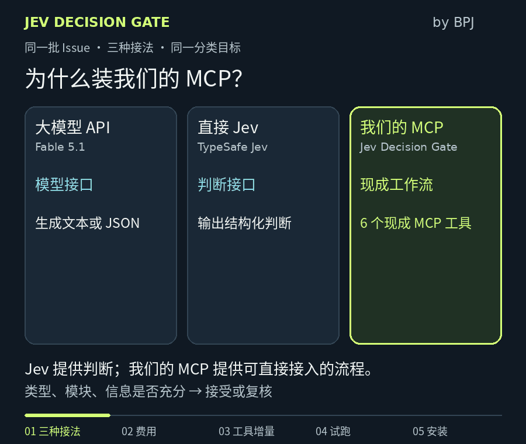

# Jev Decision Gate · BPJ 出品

[](https://github.com/f-tiger/jev-decision-gate/actions/workflows/test.yml)

**每百万输入 token，$10 → $0.042：更便宜的判断，能为你的工作流省多少？**

[English](README.md) · [MCP 接入](docs/mcp.md) · [BPJ 开发者入口](https://baipiaoji.com/developers?utm_source=github&utm_medium=readme&utm_campaign=decision_gate)



**相同的假设 token 用量，输入单价相差约 238 倍。** 按 2026-10-02 标准未缓存价格：[Claude Fable 5.1](https://platform.claude.com/docs/en/about-claude/pricing) 为 $10／百万输入 token，[Jev 1.13](https://docs.typesafe.ai/models) 为 $0.042；对比 Haiku 4.5 的 $1，差距为 23.8 倍。实际 token 数、质量和总节省仍待同任务实测。Jev 输出免费不代表输出 token 为零。

[测算口径与来源](docs/token-cost.md) · [静态图](docs/assets/token-cost-zh-CN-poster.png) · [真实规则输出](docs/assets/demo-report.json)

这是独立的 MIT 开源工具，首发面向仓库维护者和小型开发团队：输出 Issue 类型、模块和信息是否充分。提供 Python SDK、CLI、MCP 和 Skill。不会改标签、发评论或关闭 Issue。

当前 v0.3.1 是开发者预览。实现包含真正的 Jev HTTP 适配器；没有 API 密钥时，只能验证接口契约，不能宣称已完成真实 Jev 测量。随附 12 个案例由我们编写，属于合成演示，不是客户案例或代表性评测。

## 本地开始

需要 Python 3.11 或更新版本：

```bash
git clone https://github.com/f-tiger/jev-decision-gate.git
cd jev-decision-gate
python -m venv .venv
source .venv/bin/activate
python -m pip install '.[mcp]'
jev-gate demo --out demo-report.json --export-issues demo-issues.json
```

Windows PowerShell 激活命令为 `.venv\Scripts\Activate.ps1`。演示不联网、不需要密钥，运行的是确定性规则基线；所有判断默认要求复核。再次运行请使用新的输出文件名，命令不会覆盖旧报告。

无需密钥，也能复现动画中的价格计算：

```bash
python tools/price_scenario.py --input-tokens 1000000 --fallback-fraction 0.1
```

假设全部输入先经过 Jev，另有 10% 输入需调用 Fable：输入费用为 $0.042 + $1 = $1.042，对比全用 Fable 的 $10，相差约 9.6 倍。这是情景计算，未包含输出、重试和人工复核；本工具不会自动调用 Fable。[提交一次试用反馈或安装问题](https://github.com/f-tiger/jev-decision-gate/issues/new?template=tryout.yml)。

## 使用 Jev

通过本机环境或密钥管理器设置 `TYPESAFE_API_KEY`，不要把值粘贴到聊天、代码仓库或公开配置中。

```bash
jev-gate triage demo-issues.json --provider jev --max-calls 12 --out jev-report.json
```

这一步会把所选 Issue 的标题、正文发给 TypeSafe，可能产生费用。默认固定 `jev-1.13.0`，每条 Issue 一次请求，同时问三个独立问题。标准答案不会发给模型。没有自动重试；失败保留人工复核，并把未知用量明确标出。退出码 2 表示输入失败或报告中存在调用失败。

可通过 `--input-usd-per-million 当前单价` 估算已报告 Token 的费用。估算不等于账单；人工复核费用和回退模型费用没有测量，所以不会输出虚假的节省比例。

## 验证“能否自动接受”

先用独立的校准集和测试集分别得到报告，再执行：

```bash
jev-gate calibrate calibration-report.json --out policy.json
jev-gate evaluate policy.json held-out-report.json --out evaluation.json
jev-gate triage new-issues.json --provider jev --policy policy.json --out decisions.json
```

证据不足会关闭自动接受，关闭后也不调用模型。固定模型、问题、标签和打分方式后才能校准；改动任意一项都应重新收集数据。测试集不能重复使用校准集，去除语义重复也由数据负责人完成。统计约束只覆盖既定假设下被接受的预测，不能保证未来数据、人工复核或对抗输入正确。

首版模块为 `auth/api/ui/docs/unknown`，类别为 `bug/feature/question/unknown`，信息为 `sufficient/missing`。不适合该模块结构的仓库，应修改定义并重新校准。英文案例不能证明中文任务质量。

## 接入 MCP / Skill

**[下载 MCP 安装包](https://github.com/f-tiger/jev-decision-gate/releases/tag/v0.3.1)**，适用于支持 MCPB 0.4 和 UV 的宿主。选择 Issue JSON 目录即可，Jev 默认关闭。已注册到[官方 MCP Registry](https://registry.modelcontextprotocol.io/v0.1/servers/io.github.f-tiger%2Fjev-decision-gate/versions/0.3.1)，名称为 `io.github.f-tiger/jev-decision-gate`。[安装与收录状态](docs/distribution.md)。

```bash
jev-gate-mcp --data-root /你的授权数据目录
```

默认只允许本地规则。需要 Jev 时，由你明确添加 `--allow-jev` 并配置进程环境变量。完整配置见 [MCP 文档](docs/mcp.md)。Skill 源码在 `skills/jev-decision-gate/`，按宿主支持的位置安装；复制 Skill 不代表自动接管宿主的全部模型路由。

使用支持的 [Skills CLI](https://github.com/vercel-labs/skills) 安装：

```bash
npx skills add f-tiger/jev-decision-gate --skill jev-decision-gate
```

已验证 `--list` 能发现该 Skill，并完成独立安装和安装后的规则演示。安装时选择自己的 Agent。第三方 CLI 有独立的可选遥测，退出方式为 `DISABLE_TELEMETRY=1`，详见[官方说明](https://skills.sh/docs/cli)；本项目包自身没有遥测。

## 商业边界

本地工具、MCP、Skill、测试和算法全部免费开源。TypeSafe 模型费用另计。持续评估、团队策略历史和托管运行是后续待验证的收费方向，本次没有开放该产品收款。BPJ 网站负责介绍与服务入口，不上传你的代码或日志。

我们没有公开证据证明 Jev 客户“大部分是程序员”；开发者是根据其 API/SDK 分发方式选择的首批用户假设。先看真实安装、复用和询盘，不能把 Star、Fork 或网页点击当成收入。

本项目不是 Jev 的开源复刻，也不与 TypeSafe 存在官方关联。原理和限制见 [评估方法](docs/evaluation.md)，测试与待完成事项见 [验证记录](docs/verification.json)。

传播资料：[关联站点对比与 7 天验证方案](docs/growth-plan.zh-CN.md) · [中英文发布文案](docs/launch-kit.md)。项目由 AI 辅助实现，与 TypeSafe 无官方隶属关系。
